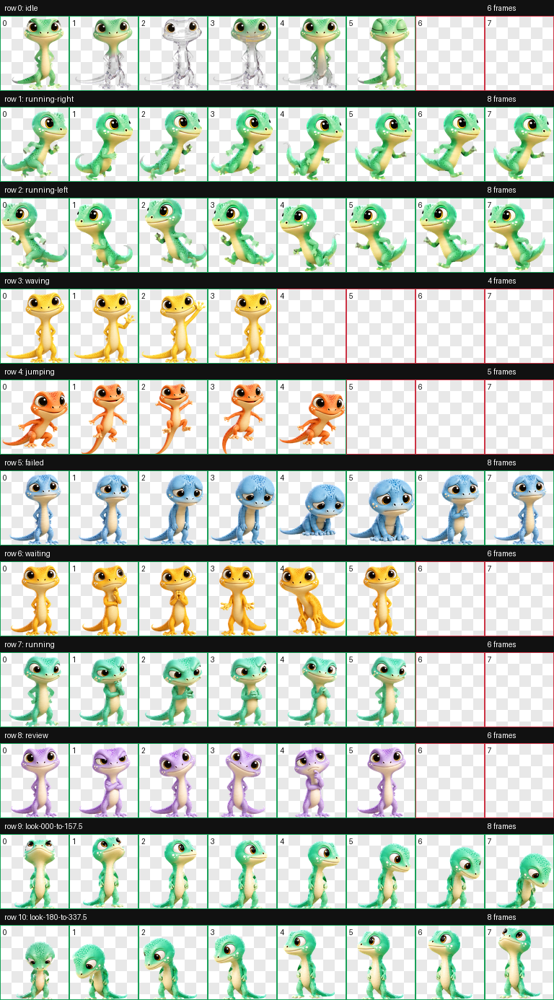
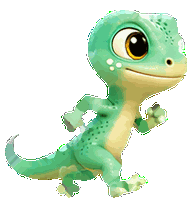
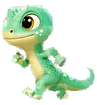

# Kiko Codex pet (v2)

Kiko is a cute color-changing gecko for Codex Desktop. Kiko keeps one recognizable gecko identity while changing body color, expression, and motion to reflect the current task condition. This repository packages Kiko as a v2 pet with six idle frames and 16 pointer-responsive look directions.



## Install

Copy the `kiko/` directory into your local Codex pets folder:

```bash
mkdir -p ~/.codex/pets/kiko
cp kiko/pet.json kiko/spritesheet.webp ~/.codex/pets/kiko/
```

Or run:

```bash
./scripts/install.sh
```

If Kiko does not appear immediately, reopen the pet picker or restart Codex Desktop.

The manifest explicitly sets `"spriteVersionNumber": 2`. While Kiko is awake as the floating desktop pet, move the pointer around Kiko to select the directional poses. Look tracking is used during idle, running, and waving; special status animations take priority.

## Condition map

| Codex state | Frames | Kiko color | Expression and motion |
|---|---:|---|---|
| `idle` | 6 | Mint green | Calm smile, camouflage fade, blink |
| `running-right` | 8 | Aqua | Determined rightward scurry |
| `running-left` | 8 | Aqua | Determined leftward scurry |
| `waving` | 4 | Sunny yellow | Cheerful hand wave |
| `jumping` | 5 | Coral orange | Thrilled vertical hop |
| `failed` | 8 | Soft blue | Gentle droop and recovery |
| `waiting` | 6 | Warm amber | Patient, empty-hands asking pose |
| `running` | 6 | Teal | Prop-free focused work loop |
| `review` | 6 | Lavender | Skeptical squint, head tilt, chin touch |

## State previews

| | | |
|---|---|---|
| **Idle**<br> | **Running right**<br> | **Running left**<br> |
| **Waving**<br> | **Jumping**<br> | **Failed**<br> |
| **Waiting**<br> | **Working**<br> | **Reviewing**<br> |

## Look directions

The first nine rows preserve Kiko's original animations. Rows 9 and 10 add 16 clockwise look poses in 22.5-degree steps:

- row 9: `000` up through `157.5` down-right
- row 10: `180` down through `337.5` up-left

Kiko's feet and lower body stay anchored while the complete eyes lead, followed by restrained head and neck movement. The focused direction sheet is available at [`run/v2/qa/look-directions.png`](run/v2/qa/look-directions.png).

The finished v2 atlas follows the Codex extended pet contract: an 8-column by 11-row `1536 × 2288` RGBA WebP made from `192 × 208` cells. Unused cells are fully transparent.

## Repository contents

- `kiko/` — the two-file installable pet package
- `run/decoded/` — original generated base and raw state strips retained for provenance
- `run/decoded-clean/` — original alpha-clean, despilled source strips retained for provenance
- `run/rejected/` — rejected iterations kept to document repair decisions
- `run/prompts/` — generated base, row, and retry prompts
- `run/references/` — canonical Kiko base and layout guides
- `run/frames/` — original extracted `192 × 208` animation frames
- `run/final/` — original reproducible 8×9 standard-animation intermediate
- `run/qa/` — original nine-state contact sheet, GIF previews, and QA JSON
- `run/v2/` — current package validation, animated state previews, generated v2 QA sheets, and historical review records
- `notes-on-creating-kiko.md` — detailed workflow notebook
- `scripts/install.sh` — local installer
- `scripts/rebuild-atlas.sh` — deterministic rebuild from cleaned strips
- `scripts/update-v2-assets.py` — validates the packaged v2 atlas and regenerates its QA sheets

## Rebuild

The original source strips for Kiko's nine standard animations are included. If the OpenAI `hatch-pet` skill is installed, rebuild that historical intermediate and validate the current packaged v2 atlas with:

```bash
./scripts/rebuild-atlas.sh
```

Set `PYTHON` to a Python executable with Pillow if `python3` is not on your path. The script deliberately never overwrites `kiko/spritesheet.webp` with the 8×9 intermediate. To update only the current package validation and v2 QA sheets, run `python3 scripts/update-v2-assets.py`.

Image generation is intentionally not automated because generated artwork is stochastic and every row needs visual review. The original standard-row prompts and images remain under `run/`; current machine-generated v2 validation and QA sheets live under `run/v2/`, alongside historical manual-review records from earlier atlas revisions.

## Credits

This repository was inspired by Simon Willison's [simonw/pedalican](https://github.com/simonw/pedalican) and his [write-up about hatching a Codex pet](https://simonwillison.net/2026/Jul/14/pedalican/).
